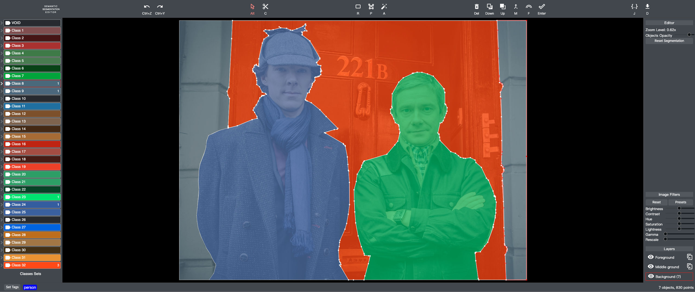

# 🐣 Semantic-Segmentation-Editor (Waiting To Hatch) 🐣

<br>

[]()
[](./README_CN.md)
[](./README.md)
[]()
[]()
[]()
[]()
[](https://github.com/geekparkhub)
[](https://github.com/aiparkhub)
[](https://github.com/eklowlabs)
[](https://github.com/eklowlabs)
[](https://github.com/jeep711)

<br>

<div align="center">


</div>
<br>


- **Eklow Labs | Make the world a better place by building the perfect system for code reuse and extension**
- **`Official Public Email`**
- Organization Email：<aiparkhub@outlook.com> —— <geekparkhub@outlook.com> —— <hackerparkhub@outlook.com>  —— <eklowlabs@outlook.com>
- Developer Email：<jeep711.home.@gmail.com> —— <jeep-711@outlook.com>
- System Email：<systemhub-711@outlook.com>
- Service Email：<servicehub-711@outlook.com>


## 1. Foreword
#### Tribute to contributors in all areas of technology

### 1.1 Overview
> [Semantic-Segmentation-Editor](https://github.com/eklowlabs/Semantic-Segmentation-Editor) It was developed in the context of research on autonomous driving, By` Eklow Labs` Powerful lightweight image semantic segmentation open source project built based on web tagging tool deep mining;

### 1.2 Feature Highlights
> It will be used to create (2D and 3D) image segmentation AI training datasets, This tool supports image files (.jpg or .png) and point cloud formats (.pcd) binary files;

#### 1.2.1 Bitmap image Editor
> Bitmap image before editing
> 
> 

> Bitmap image after editing
> 
> 


#### 1.2.2 PCD Point Cloud Editor


## 2. Project Tree Structure
```
.
├── LICENSE
├── README.md
├── README_CN.md
├── client
│   ├── jsSetExtensions.js
│   ├── layout.css
│   ├── main.html
│   ├── main.js
│   ├── main.less
│   ├── rc-slider.less
│   ├── routes.jsx
│   └── tippy.css
├── docs
│   └── resource
│       ├── demo
│       │   ├── after_image_segmentation-2.jpg
│       │   ├── after_image_segmentation.jpg
│       │   ├── before_image_segmentation.jpg
│       │   └── pcd_point_cloud.jpg
│       ├── group_sign
│       │   ├── aiparkhub_organization_sign.svg
│       │   └── eklowlabs_organization_sign.svg
│       └── private
│           └── samples
│               ├── bitmap_labeling.jpg
│               └── pointcloud_labeling.pcd
├── imports
│   ├── common
│   │   ├── MapSet.js
│   │   ├── SseBottomBar.jsx
│   │   ├── SseBranding.jsx
│   │   ├── SseClassChooser.jsx
│   │   ├── SseConfirmationDialog.jsx
│   │   ├── SseDataManager.js
│   │   ├── SseGlobals.jsx
│   │   ├── SseMsg.js
│   │   ├── SsePopup.jsx
│   │   ├── SseSetOfClasses.js
│   │   ├── SseText.jsx
│   │   ├── SseTheme.js
│   │   └── SseToolbar.jsx
│   ├── editor
│   │   ├── 2d
│   │   │   ├── SseApp2d.jsx
│   │   │   ├── SseEditor2d.jsx
│   │   │   ├── SseGeometry.jsx
│   │   │   ├── SseLayers.jsx
│   │   │   ├── SseSliderPanel.jsx
│   │   │   ├── SseToolbar2d.jsx
│   │   │   ├── SseTooltips2d.jsx
│   │   │   ├── SseUndoRedo2d.js
│   │   │   ├── SseZoom.js
│   │   │   └── tools
│   │   │       ├── SseCutTool.js
│   │   │       ├── SseFloodPanel.jsx
│   │   │       ├── SseFloodTool.js
│   │   │       ├── SsePointerTool.js
│   │   │       ├── SsePolygonTool.js
│   │   │       ├── SseRectangleTool.js
│   │   │       ├── SseTool.js
│   │   │       └── magicwand.js
│   │   ├── 3d
│   │   │   ├── GradientBoxHelper.js
│   │   │   ├── SseApp3d.jsx
│   │   │   ├── SseCameraToolbar.jsx
│   │   │   ├── SseEditor3d.jsx
│   │   │   ├── SseObjectToolbar.jsx
│   │   │   ├── SsePCDLoader.js
│   │   │   ├── SseToolbar3d.jsx
│   │   │   ├── SseTooltips3d.jsx
│   │   │   └── tools
│   │   │       ├── OrbitControls.js
│   │   │       ├── Sse3dCircleSelector.js
│   │   │       ├── Sse3dLassoSelector.js
│   │   │       ├── Sse3dRectangleSelector.js
│   │   │       └── Sse3dSelector.js
│   │   └── SseEditorApp.jsx
│   └── navigator
│       ├── SseAllAnnotated.jsx
│       ├── SseImageThumbnail.jsx
│       ├── SseNavigatorApp.jsx
│       ├── SseNavigatorMenu.jsx
│       └── SseNavigatorToolbar.jsx
├── lib
│   └── collections.js
├── package-lock.json
├── package.json
├── public
│   ├── SseDataWorker.js
│   ├── pcl_horz_large_neg.png
│   └── pcl_vert_large_neg.png
├── server
│   ├── SseDataWorkerServer.js
│   ├── api.js
│   ├── config.js
│   ├── files.js
│   └── main.js
└── settings.json

18 directories, 76 files
```

## 3. How To Use
### 3.1 Clone Engineering
``` bash
git clone https://github.com/eklowlabs/Semantic-Segmentation-Editor.git
```

### 3.2 installation (OSX or Linux) 
```shell
curl https://install.meteor.com/ | sh
```
or Download [Meteor Windows Installer](http://www.meteor.com/install)


### 3.3 Launch application
```shell
cd Semantic-Segmentation-Editor-x.x.x
meteor npm install
meteor npm start
```

By default the editor will be in `http://localhost:3000` run;


### 3.4 Optional) Edit `settings.json`
 
> By default, images from <code>your_home_dir/sse-images</code> and pointcloud binary segmented data is stored in<code>your_home_dir/sse-internal</code>.
> You can configure these folders in settings.json by modifying<code>images-folder</code> and <code>internal-folder</code> Attributes. On Windows, use '/' separators, example <code>c:/Users/john/images</code>

### 3.5 Configuration File `settings.json`
``` bash
{
  "configuration": {
    "images-folder": "/xxx/images", // Root folder containing images and PCD files
    "internal-folder": "/xxx/pointcloud_data" // Split data (3D only) will be stored in this folder
  },
  // The different sets of classes available in the tool
  // For object classes, only the 'label' field is mandatory
  // The icon field can be set with an icon from the mdi-material-ui package
  "sets-of-classes": [
    {
      "name": "Cityscapes", "objects": [
      {"label": "VOID", "color": "#CFCFCF"},
      {"label": "Road", "color": "#804080", "icon": "Road"},
      {"label": "Sidewalk", "color": "#F423E8", "icon": "NaturePeople"},
      {"label": "Parking", "color": "#FAAAA0", "icon": "Parking"},
      {"label": "Rail Track", "color": "#E6968C", "icon": "Train"},
      {"label": "Person", "color": "#DC143C", "icon": "Walk"},
      {"label": "Rider", "color": "#FF0000", "icon": "Motorbike"},
      {"label": "Car", "color": "#0000E8", "icon": "Car"}
    },
    { ... }
  ]
}
```
f
### 3.6 Using the bitmap image editor
#### 3.6.1 Polygon drawing tools (P)
- Click and / or drag to create points;
- ESC key deletes last created point in reverse order;
- Create complex polygons by dragging the mouse pointer or holding down the Shift key without having to click for each point;
- Enter key or double click on the first point to close the polygon;
  
  
#### 3.6.2 Magic tool (A)
- Automatically create polygons using contrast threshold detection;
- This tool can only be used to draw the contours of objects with sharp edges (e.g. sky, lane markings);
- Click inside the area you want to outline, and adjust any slider on the right to adjust the result;
- Verify the result with the Enter button;

#### 3.6.3 Operating tools (Alt)
- Select, move points and add them to existing polygons;
- Click inside the polygon to select it;
- Click on a point to select it;
- Draw lasso around multiple points to select them;
- Drag a point with the mouse to move it;
- Hold down the Shift key to separate points that belong to multiple polygons;
- Click on the line of the polygon to create a new point, and then drag the newly created point to place it;

#### 3.6.4 Cutting / Expansion Tool (C)
- Modify the shape of an existing polygon;
- Select the polygon to be modified;
- Draw a start and end line on the outline of the polygon;
- A new line replaces the existing path between the start and end points;
- The resulting shape is always the largest shape;

#### 3.6.5 Continuous Polygon Tool (F)
- Easily create continuous polygons;
- Start a new polygon with the polygon drawing tool;
- Create a starting point by capturing the outline of the polygon to be solved;
- Create an end point by snapping to another contour, at which point you must have a line that intersects one or more existing polygons;
- Press the F key once or several times to select the solution to be used;


### 3.7 Use Point Cloud Editor
- Left mouse button: rotate the point cloud around the current focus (by default, the center of the point cloud), click on a single point to add it to the current selection;
- Mouse wheel: zoom in / out;
- Middle mouse button (or Ctrl + Click) to change the target of the camera;
- Right mouse button: used to select multiple points at the same time according to the current selection tool and selection mode;


### 3.8 PCD Support
- Supported input PCD formats: ASCII, binary and binary compression
- Support input fields: `x`，`y`，`z`，`label`(Optional integer), `rgb`(Optional integer);
- The output PCD format is ASCII with fields `x`, `y`, `z`, `label`, `object`  和 `rgb` (If available)

### 3.9 API
- <code>/api/listing</code>: List all annotated images;
- <code>/api/json/[PATH_TO_FILE]</code>: (2D only) Get polygons and other data for this file;
- <code>/api/pcdtext/[PATH_TO_FILE]</code>: (3D only) Get tags for pcd files with 2 additional elements;
Column: <code>label</code>
and <code>Object</code>
-  <code>/api/pcdfile/[PATH_TO_FILE]</code>: (3D only) Same, but returns as "plain text / text" attachment file download;


## 4. Open Source Agreement
 [MIT License](./LICENSE)
 
 ---------
